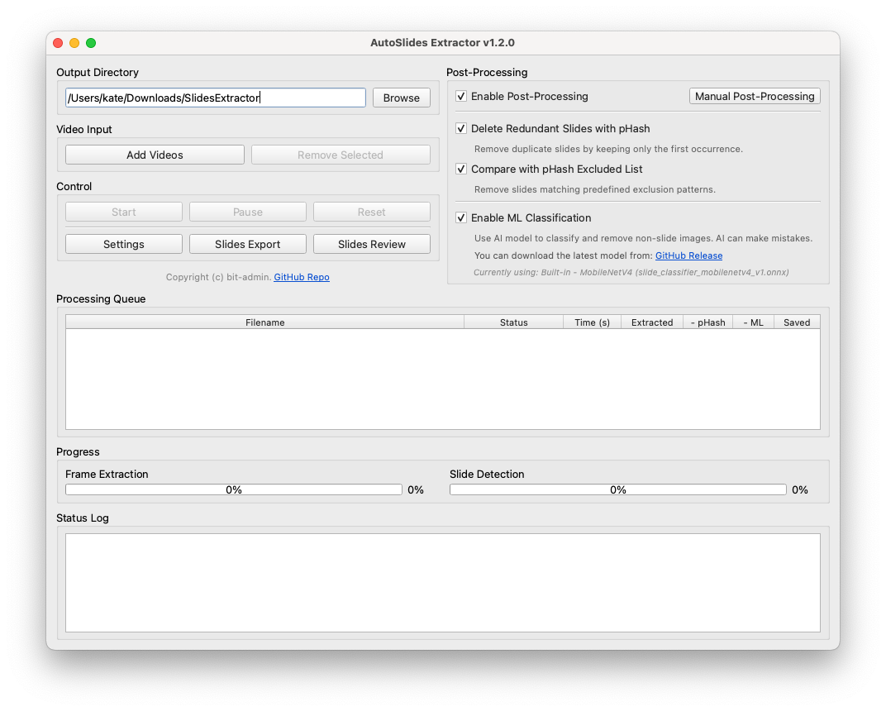
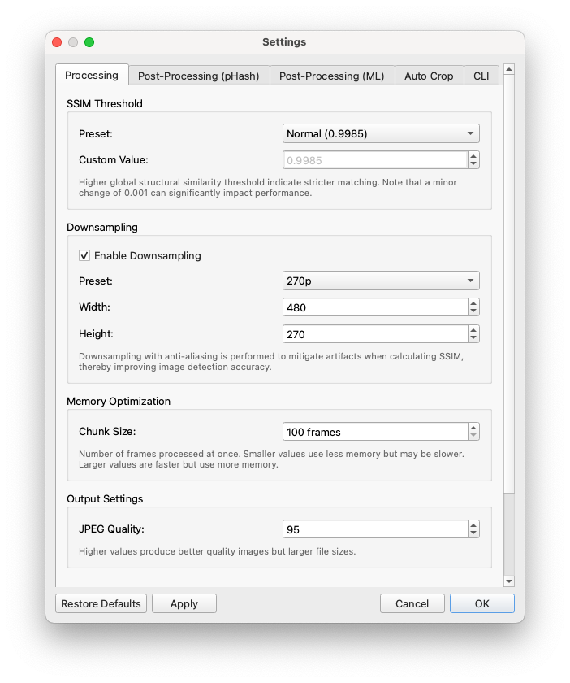
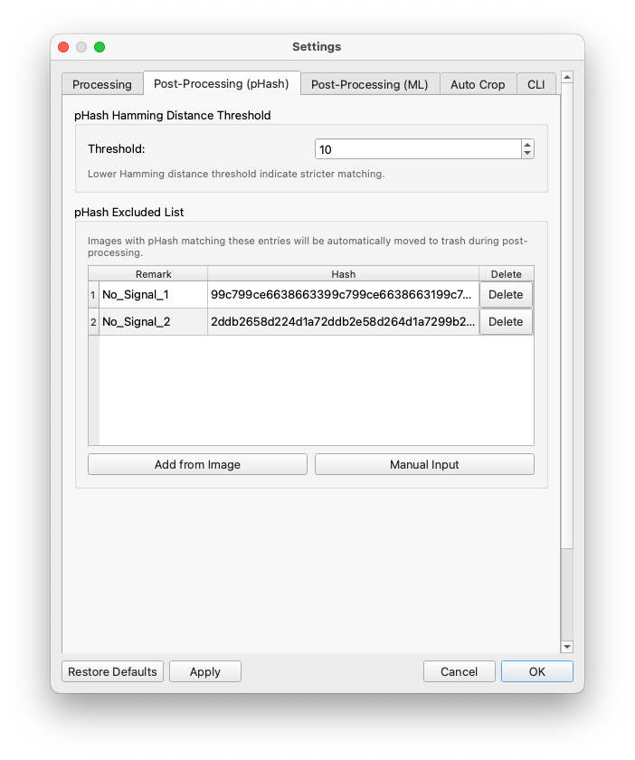
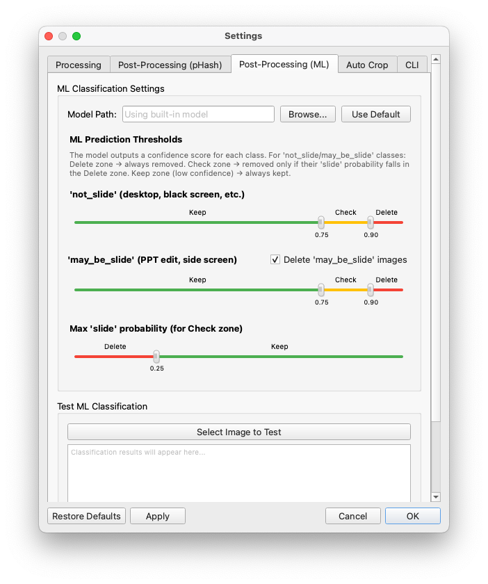
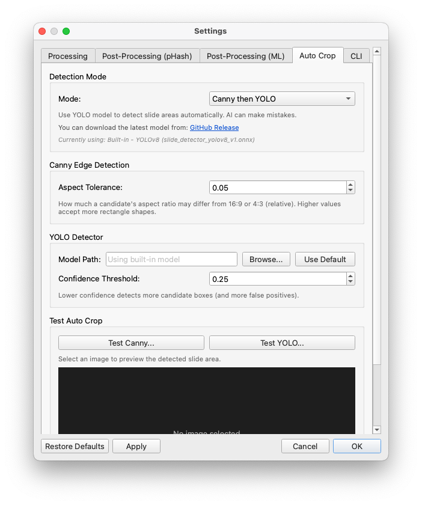
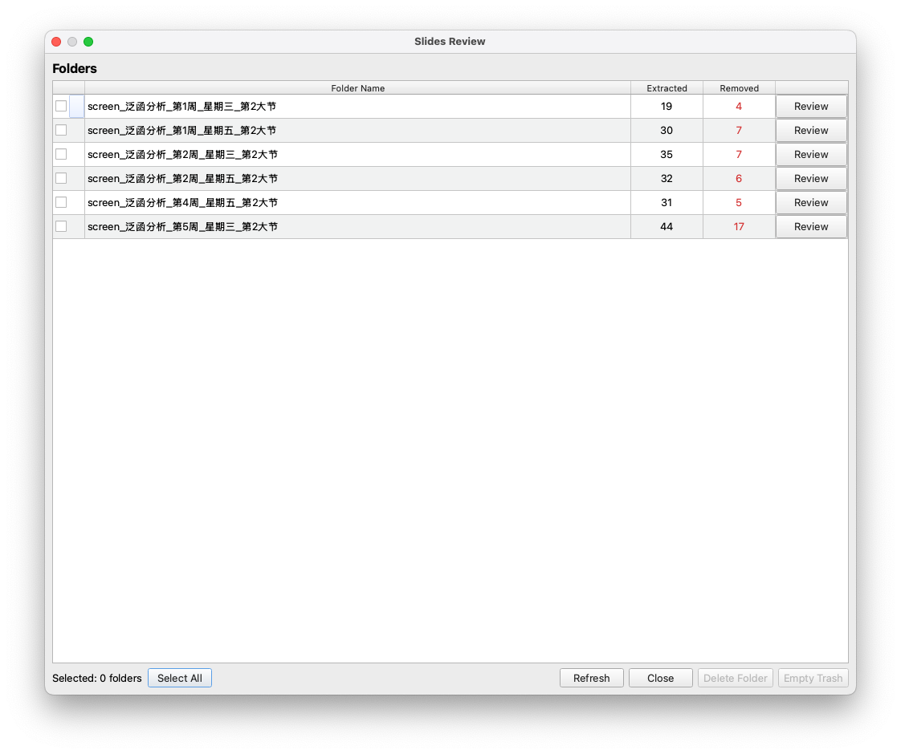
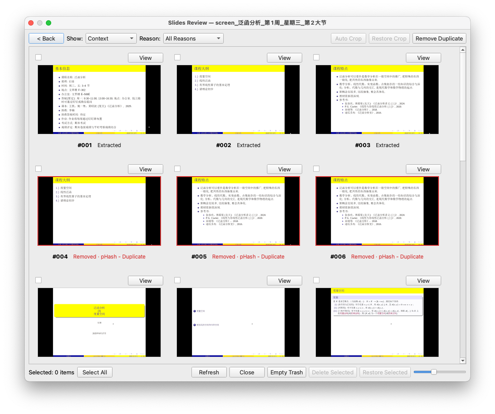
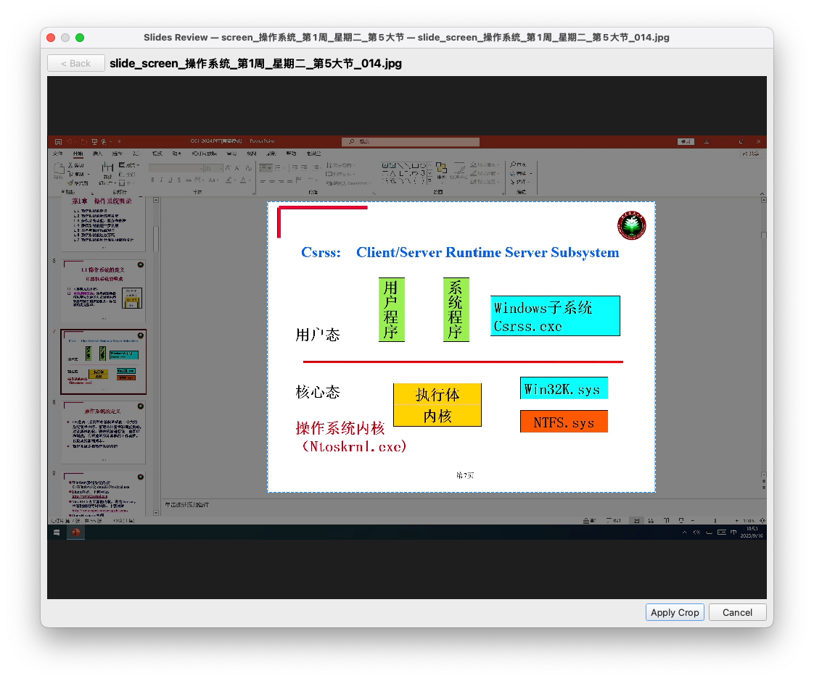
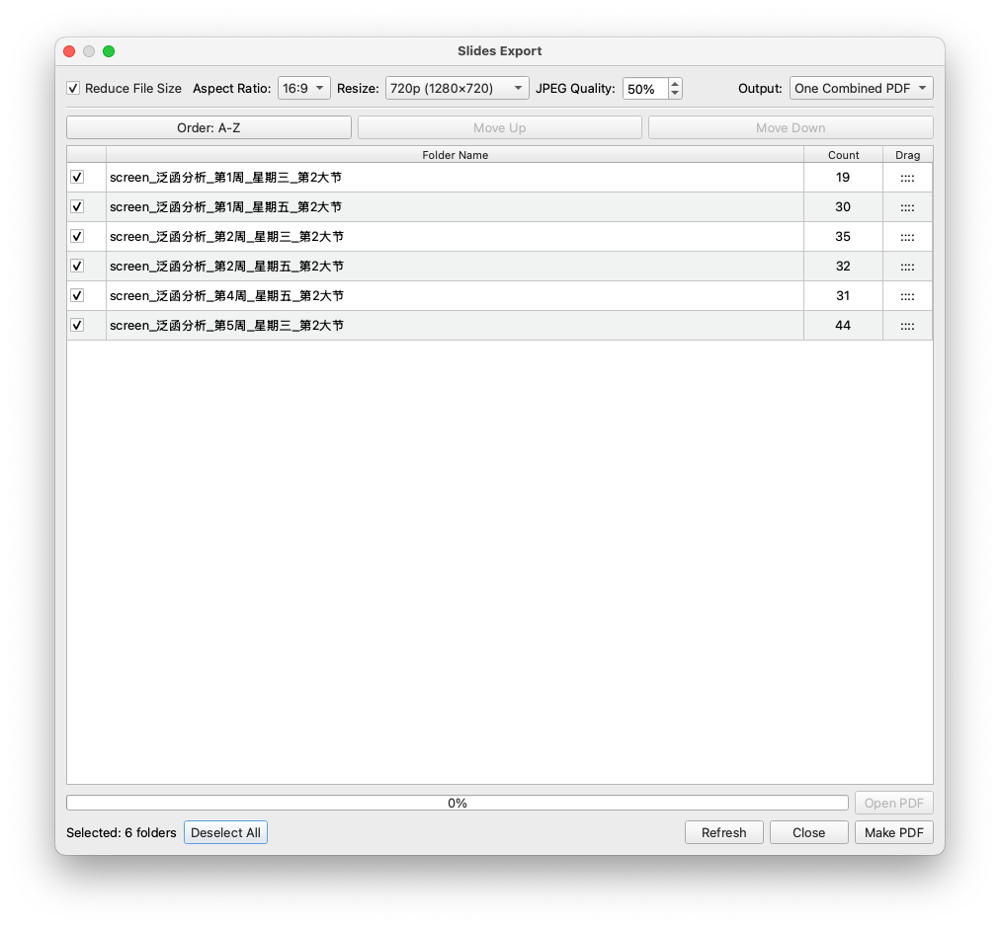
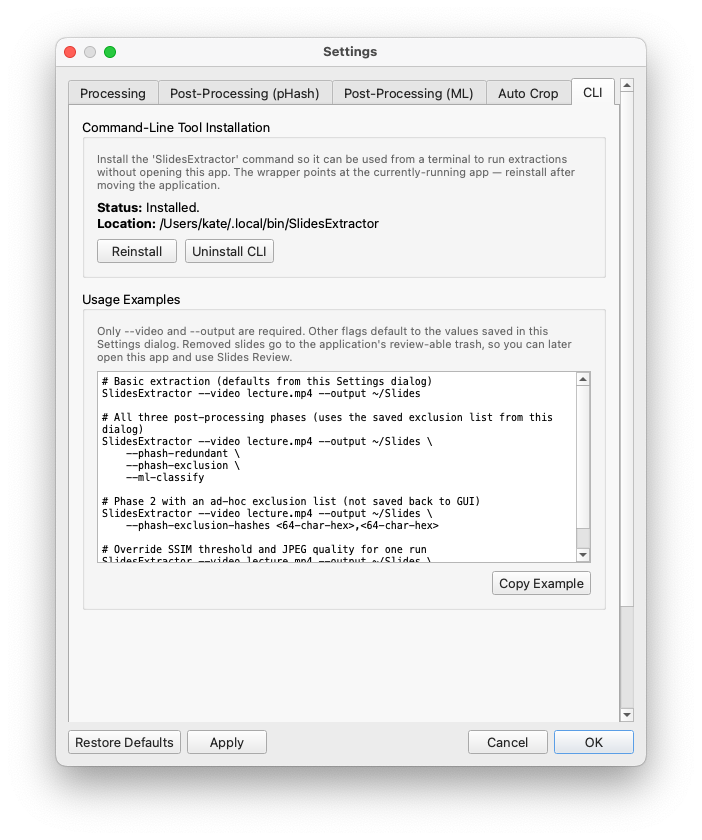

<div align="center">
  

  # AutoSlides Extractor

  <p><strong>Extract clean slide images from lecture and presentation videos with computer vision,<br>pHash cleanup, ML filtering, review tools, cropping, and PDF export.</strong></p>

  <p>
    <a href="https://github.com/bit-admin/AutoSlides-Extractor/releases">
      
    </a>
    
    
  </p>
  <p>
    
    
    
    
  </p>
  <p>
    English | <a href="README_zh-CN.md">简体中文</a>
  </p>
</div>

## Contents

- [Overview](#overview)
- [What Is New In 2.0.0](#what-is-new-in-200)
- [Features](#features)
- [Download And Installation](#download-and-installation)
- [Quick Start](#quick-start)
- [User Guide](#user-guide)
- [Processing Settings](#processing-settings)
- [Post-Processing With pHash](#post-processing-with-phash)
- [ML Classification](#ml-classification)
- [Auto Crop](#auto-crop)
- [Slides Review](#slides-review)
- [Slides Export](#slides-export)
- [Command Line Guide](#command-line-guide)
- [Output Files And Metadata](#output-files-and-metadata)
- [How It Works](#how-it-works)
- [Build From Source](#build-from-source)
- [Troubleshooting](#troubleshooting)
- [Practical Recommendations](#practical-recommendations)
- [Related Projects](#related-projects)
- [License](#license)

## Overview

AutoSlides Extractor is a native desktop application for turning recorded lectures, online courses, conference talks, screen recordings, and presentation videos into slide images.

Instead of extracting frames at a fixed interval, the app analyzes visual similarity between frames and saves only meaningful slide changes. After extraction, it can remove duplicate slides, filter unwanted title or blank screens with pHash rules, classify non-slide content with an ONNX MobileNetV4 model, let you review everything that was extracted or removed, crop slides non-destructively, and export selected folders to PDF.

The app is designed for local processing. Video decoding, image comparison, ML classification, review, cropping, and PDF generation run on your machine.

## What Is New In 2.0.0

Version 2.0.0 introduces media-time timeline tracking, intelligent post-process auto-cropping, and optimized Windows releases:

- **Timeline (`timeline.json`)**: Generates a colocated media-time -> slide map during extraction, recording I-frame PTS timings for slide transitions and maintaining mutable resolution statuses (`canonical`, `duplicate`, `gap`).
- **Post-Process Auto-Crop**: Automatically detects slide regions on ambiguous `may_be_slide` captures before deletion—cropping and keeping valid slides instead of trashing them, with candidate-only post-crop pHash duplicate re-checking.
- **New CLI Options**: Headless options including `--write-timeline`, `--ml-autocrop-maybe`, `--ml-postcrop-dedup`, and `--compatible`.
- **Optimized Windows Release Package**: Windows prebuilt packages switch to DirectML/CPU ONNX Runtime (`onnxruntime-win-x64`), eliminating external NVIDIA CUDA redistributable DLLs for a lightweight, standalone installation while preserving hardware-accelerated ML inference out of the box via DirectML.

See [CHANGELOG.md](CHANGELOG.md) for the full release history.

## Features

### Slide Extraction

- Detects distinct slides using Structural Similarity Index (SSIM).
- Uses a two-stage slide detection pipeline: transition detection followed by stability verification.
- Samples video efficiently with hardware decoder support where available.
- Saves slides as JPEG images using configurable quality.
- Supports common video formats through FFmpeg, including MP4, MKV, AVI, MOV, and WMV.
- Queues multiple videos and processes them sequentially.

### Intelligent Cleanup

- Removes redundant slides with perceptual hashing (pHash).
- Compares extracted slides against a configurable pHash exclusion list.
- Tags removed slides with stable categories such as `phash_duplicate`, `phash_excluded`, `ml_not_slide`, `ml_maybe_slide`, and `manual`.
- Stores removed slides in application trash instead of silently deleting them.

### ML Slide Classification

- Uses a bundled MobileNetV4 ONNX classifier when ONNX Runtime is available.
- Keeps images classified as `slide`.
- Removes `not_slide` content such as desktop screens, black screens, and no-signal frames based on confidence thresholds.
- Optionally removes `may_be_slide` content such as ambiguous presentation editor or side-screen captures.
- Can use Core ML on macOS, CUDA or DirectML on Windows, CUDA on Linux, or CPU fallback.

### Slides Review And Cropping

- Reviews extracted and removed slides in one folder-based dialog.
- Filters by extracted/removed state and by removal reason.
- Restores removed slides or deletes extracted slides into application trash.
- Opens individual slides in a full-window viewer.
- Crops extracted slides non-destructively with backups and metadata.
- Restores crops, recrops from the original backup, or applies a baseline crop to many slides.
- Runs Auto Crop on selected extracted slides and recoverable `ml_maybe_slide` removed items.

### Slides Export

- Browses extracted slide folders under the output directory.
- Selects one or more folders for PDF export.
- Sorts folders naturally or uses custom ordering.
- Exports one combined PDF or one PDF per selected folder.
- Offers resize, aspect ratio, and JPEG quality controls when reducing file size.

### Performance

- Uses multi-threaded processing and memory-conscious chunking for large videos.
- Enables SIMD optimizations where supported: NEON, SSE4.2, AVX2, and AVX512.
- Detects platform hardware acceleration options such as VideoToolbox, CUDA, OpenCL, Metal, DirectX, and Vulkan.

## Download And Installation

### Prebuilt Releases

Download release packages from the [GitHub Releases page](https://github.com/bit-admin/AutoSlides-Extractor/releases).

Available release assets may vary by version. In general:

- **macOS**: use the `.dmg` package when provided.
- **Windows**: use the installer or portable archive when provided. Prebuilt Windows packages use DirectML and CPU ONNX Runtime for hardware-accelerated ML inference without requiring CUDA drivers or external CUDA DLLs.
- **Linux**: build from source unless a Linux package is published for your target distribution.

### macOS Gatekeeper Note

If macOS reports that the downloaded app cannot be opened because it is from an unidentified developer or is damaged, remove the quarantine attribute after installing:

```bash
sudo xattr -d com.apple.quarantine /Applications/AutoSlides\ Extractor.app
```

### System Requirements

| Component | Recommended |
| --- | --- |
| OS | macOS 11+, Windows 10+ x64, or a modern Linux distribution |
| CPU | Quad-core or better |
| Memory | 8 GB minimum, 16 GB or more for long recordings |
| Disk | Enough free space for extracted JPEGs, trash backups, crop backups, and PDFs |
| GPU | Optional, but useful for video decoding and ML acceleration |

## Quick Start

1. Launch **AutoSlides Extractor**.
2. Click **Add Videos** and select one or more video files.
3. Choose an output directory. The default is `~/Downloads/SlidesExtractor`.
4. Keep the default settings for the first run unless you already know the video needs special handling.
5. Click **Start**.
6. Watch the queue, progress bars, and status log.
7. Open the output directory and inspect the generated `slides_<video-name>/` folders.
8. Click **Slides Review** to inspect extracted and removed slides, restore false positives, crop slides, and re-run duplicate cleanup.
9. Click **Slides Export** to create PDFs from selected slide folders.

## User Guide

### Main Window

<p align="center">
  
</p>

The main window is organized around a video queue, processing controls, post-processing controls, progress bars, and a status log.

### Main Workflow

1. Click **Add Videos**.
2. Select one or more video files.
3. Choose the output directory.
4. Confirm post-processing options on the right side.
5. Click **Start**.
6. Wait for each queue item to reach **Completed**.
7. Use **Slides Review** to inspect results.
8. Use **Slides Export** to generate PDFs.

### Queue Columns

| Column | Meaning |
| --- | --- |
| Filename | Input video name. |
| Status | Current queue state. |
| Time (s) | Processing time for the video. |
| Extracted | Raw number of slide images extracted before cleanup. |
| - pHash | Number removed by pHash duplicate or exclusion cleanup. |
| - ML | Number removed by ML classification. |
| Saved | Remaining slide count after cleanup. |

### Main Controls

| Button | Use |
| --- | --- |
| **Start** | Begins processing the queued videos. |
| **Pause** | Pauses active processing where possible. |
| **Reset** | Clears progress and resets the queue state. |
| **Settings** | Opens all processing, pHash, ML, Auto Crop, and CLI settings. |
| **Slides Export** | Opens the PDF export workflow. |
| **Slides Review** | Opens the review, restore, delete, crop, and duplicate cleanup workflow. |
| **Manual Post-Processing** | Runs the current pHash and ML cleanup settings on an existing image folder. |

## Processing Settings

<p align="center">
  
</p>

Open **Settings** and use the **Processing** tab for extraction sensitivity and output quality.

### SSIM Presets

SSIM is a similarity score. Higher thresholds are more sensitive to visual changes.

| Preset | Threshold | Best for |
| --- | ---: | --- |
| Strict | `0.9990` | Videos where small slide changes are being missed. |
| Normal | `0.9985` | Typical lecture recordings and screen captures. |
| Loose | `0.9980` | Videos with animations, cursor movement, or noisy compression. |
| Custom | User-defined | Fine tuning difficult videos. |

Practical tuning:

- If the app misses slides, try **Strict** or a higher custom threshold.
- If the app saves too many animation frames, try **Loose** or a lower custom threshold.
- Keep the first test run on **Normal** unless you already know the recording is difficult.

### Downsampling

Downsampling resizes frames before SSIM comparison. It improves speed and can reduce noise from tiny compression artifacts.

Defaults:

- Enabled
- Width: `480`
- Height: `270`

Turn it off only when you need maximum sensitivity to very small visual changes.

### Chunk Size

Chunking limits memory use for long videos. The default chunk size is `100` frames. Increase it only if you have enough memory and want fewer chunk boundaries.

### JPEG Quality

The extraction and crop workflows save JPEGs. Higher quality keeps sharper slides but produces larger files.

Default: `95`

Suggested values:

- `95`: best archive quality.
- `85`: good balance for PDFs and sharing.
- `70-80`: smaller files when text remains readable.

## Post-Processing With pHash

<p align="center">
  
</p>

pHash cleanup removes images that are visually close even if their pixels are not identical.

### Main Controls

| Control | Effect |
| --- | --- |
| **Enable Post-Processing** | Enables cleanup after extraction. |
| **Delete Redundant Slides with pHash** | Removes duplicate or near-duplicate extracted slides. |
| **Compare with pHash Excluded List** | Removes slides matching saved exclusion hashes. |
| **Hamming Distance Threshold** | Controls how similar two pHashes must be to match. |

### Hamming Threshold

Lower values are stricter. Higher values catch more near-matches but can remove slides that are meaningfully different.

Default: `10`

Suggested tuning:

- Too many false duplicate removals: lower the threshold.
- Too many duplicates remain: raise the threshold gradually.
- Start with small changes such as `8`, `10`, `12`, and review results.

### Exclusion List

Use the exclusion list for slides you always want removed, such as repeated title cards, black frames, or institutional intro/outro screens.

You can add entries two ways:

- **Add from Image**: choose an example image and let the app calculate its pHash.
- **Manual Input**: paste a 64-character hex pHash.

During post-processing, matching extracted slides are moved to `.extractorTrash/` and tagged as `phash_excluded`.

## ML Classification

<p align="center">
  
</p>

ML classification is available when the app is built with ONNX Runtime. The bundled classifier uses MobileNetV4 and three class families:

| Class family | Default behavior |
| --- | --- |
| `slide` | Always kept. |
| `not_slide` | Removed when thresholds say confidence is high enough. |
| `may_be_slide` | Removed when enabled and thresholds say confidence is high enough. |

Typical `not_slide` examples include desktop screens, black screens, no-signal screens, and obvious non-presentation frames.

Typical `may_be_slide` examples include presentation editor mode, side screens, or ambiguous captures that might contain slide material.

### Two-Stage Threshold Logic

For `not_slide` and `may_be_slide`, the app uses a conservative two-stage rule:

1. Delete when the predicted class confidence is at or above the high threshold.
2. Delete when confidence is between low and high threshold only if the model's `slide` probability is below the slide-max threshold.
3. Keep everything else.

Defaults:

| Setting | Default |
| --- | ---: |
| `not_slide` high threshold | `0.90` |
| `not_slide` low threshold | `0.75` |
| `may_be_slide` high threshold | `0.90` |
| `may_be_slide` low threshold | `0.75` |
| Max `slide` probability for medium-confidence deletion | `0.25` |

### Post-Process Auto-Crop For `may_be_slide`

When **Delete 'may_be_slide' Images** is enabled, the app can run post-process auto-cropping before sending an ambiguous frame to trash:

1. **In-place Crop**: `AutoCropDetector` (Canny/YOLO) detects the slide area on the `may_be_slide` frame. If detection succeeds, the slide is cropped non-destructively in place and retained (`autoCropped=true`).
2. **Post-Crop pHash Re-check**: Retained auto-cropped slides undergo a candidate-only pHash pass to ensure they are not duplicate copies of existing slides.
3. **Settings**: Configurable via Settings -> ML Classification (`mlAutoCropMaybeSlides` and `mlPostCropDedup`, enabled by default in GUI).

### Execution Provider

Use **Auto** unless you are debugging a platform-specific inference problem.

Provider options:

- **Auto**
- **CoreML**
- **CUDA**
- **DirectML**
- **CPU**

Platform behavior:

- macOS can use Core ML when supported by the ONNX Runtime build.
- Windows uses DirectML (accelerated on DirectX 12 compatible GPUs) or CPU in prebuilt releases. CUDA acceleration is available when building from source with the GPU ONNX Runtime package.
- Linux can use CUDA when available.
- CPU fallback works on all platforms but is slower.

### Testing A Single Image

Use **Select Image to Test** on the ML settings tab to classify a representative slide before running a large batch.

Review:

- predicted class
- confidence
- all class probabilities
- active execution provider

## Auto Crop

<p align="center">
  
</p>

Auto Crop detects the slide region inside a screenshot or recording frame. It does not commit a crop by itself in the viewer; it pre-fills a crop rectangle, and you click **Apply Crop** when it looks correct.

### Modes

| Mode | Behavior |
| --- | --- |
| **Canny then YOLO** | Try classical edge detection first, then fall back to the YOLO detector. |
| **Canny only** | Use only OpenCV edge detection. |
| **YOLO only** | Use only the ONNX YOLO detector. |

Default: **Canny then YOLO**

### Canny Aspect Tolerance

The Canny detector looks for a strong rectangular slide region close to common slide aspect ratios.

Default: `0.05`

Increase this value if slides are not exactly 16:9 or 4:3. Decrease it if the detector accepts too many non-slide rectangles.

### YOLO Confidence Threshold

Default: `0.25`

Lower values detect more candidate boxes and more false positives. Higher values are stricter.

### Test Auto Crop

Use **Test Canny...** or **Test YOLO...** to select an image and preview the detected slide box. This is the fastest way to tune settings before batch cropping.

## Slides Review

Slides Review is the main safety workflow in the app. Use it after extraction to inspect both kept and removed slides.

### Folders Page

<p align="center">
  
</p>

The folders page lists slide folders under the output directory.

| Column | Meaning |
| --- | --- |
| Folder | A `slides_<video-name>` folder. |
| Extracted | Current live slide count. |
| Removed | Matching items in `.extractorTrash/`. |
| Review | Opens the folder image grid. |

Available actions:

- **Select All / Deselect All**: toggles checked folders.
- **Empty Trash**: empties removed items for checked folders.
- **Delete Folder**: moves checked slide folders and matching trash/crop metadata to system trash.
- **Refresh**: rescans folders and metadata.

### Images Page

<p align="center">
  
</p>

The images page interleaves extracted and removed items in slide-index order.

Visual cues:

- Extracted slides are live files in the `slides_<video-name>/` folder.
- Removed slides have a red visual treatment.
- Removed slides show reason badges such as **pHash - Duplicate**, **ML - Not Slide**, or **Manual**.
- Cropped extracted slides show a **Cropped** badge.

### Filters

The **Show** filter controls which item states are visible:

- Show Both
- Show Extracted Only
- Show Removed Only

The **Reason** filter applies to removed items:

- All Reasons
- pHash - Duplicate
- pHash - Excluded
- ML - Not Slide
- ML - May Be Slide
- Manual

Selection helpers operate only on the visible filtered items.

### Image Actions

| Action | Applies to | Effect |
| --- | --- | --- |
| **View** | Any item | Opens the full-window viewer. |
| **Restore Selected** | Removed items | Moves selected removed slides back to their original folder. |
| **Delete Selected** | Extracted items | Moves selected live slides to application trash as `manual`. |
| **Restore Crop** | Cropped extracted items | Restores original images from `.extractorCrop/`. |
| **Remove Duplicate** | Current folder | Re-runs pHash duplicate cleanup on the folder using the current Hamming threshold. |
| **Auto Crop** | Extracted items and removed `ml_maybe_slide` items | Detects slide regions and applies crop workflows. |
| **Set as Baseline** | Cropped extracted item | Captures that crop rectangle as a reusable baseline. |
| **Apply Baseline** | Selected non-cropped extracted items | Applies the baseline crop proportionally. |

### Viewer Page And Manual Crop

<p align="center">
  
</p>

The viewer opens one item at a time.

For extracted slides:

1. Click **Crop**.
2. Drag a rectangle around the slide area.
3. Click **Apply Crop**.
4. The app copies the original image to `.extractorCrop/`.
5. The live `slide_*.jpg` is replaced with the cropped version.
6. Metadata records the crop rectangle in original image pixels.

For removed slides:

- The viewer is read-only.
- Use **Back** to return to the grid.
- Restore the item from the grid before editing it.

### Restore Crop

Use **Restore Crop** when a crop was too tight, too loose, or no longer wanted. The app restores the backed-up original from `.extractorCrop/` and removes the crop metadata entry.

### Recrop

Use **Recrop** when a slide is already cropped but needs a better rectangle. Recrop starts from the original backup, not the currently cropped image, so repeated cropping does not degrade the slide.

### Baseline Crop

Baseline Crop is useful when a whole lecture has the same captured window border.

1. Crop one representative slide.
2. Return to the image grid.
3. Click **Set as Baseline** on the cropped slide.
4. Select other non-cropped extracted slides.
5. Click **Apply Baseline**.

The app scales the baseline rectangle proportionally to each target image size, then clamps it to the image bounds.

### Auto Crop Batch

The image-grid **Auto Crop** button is enabled only when the selection contains compatible items:

- extracted slides
- removed slides with category `ml_maybe_slide`

It is disabled if the selection contains removed `phash_duplicate`, `phash_excluded`, `ml_not_slide`, or `manual` items.

For extracted slides, Auto Crop detects a rectangle and applies it through the normal crop manager.

For removed `ml_maybe_slide` items, Auto Crop first detects a valid slide area in the trashed file. If detection succeeds, it restores the item and crops it. If detection fails, it skips the item.

## Slides Export

<p align="center">
  
</p>

Slides Export creates PDF documents from slide folders.

### Workflow

1. Click **Slides Export** in the main window.
2. Review the list of `slides_*` folders.
3. Select one or more folders.
4. Choose the output mode.
5. Choose ordering.
6. Choose file size and quality settings.
7. Click **Make PDF**.
8. Click **Open PDF** after export completes.

### Output Modes

| Mode | Result |
| --- | --- |
| One Combined PDF | One PDF containing all selected folders in order. |
| One PDF per Folder | A batch output folder containing one PDF for each selected slide folder. |

### Ordering

The default order is natural A-Z sorting. Natural sorting handles numbers, dates, English weekday/month names, and Chinese weekday terms more predictably than plain string sorting.

Use custom ordering when folder order matters:

1. Toggle to custom order.
2. Select a folder row.
3. Use **Move Up** and **Move Down**, or drag where supported.
4. Export when the order is correct.

### File Size Controls

When **Reduce File Size** is enabled:

- choose aspect ratio, such as 16:9 or 4:3
- choose resize preset
- choose JPEG quality

Suggested settings:

| Goal | Suggested settings |
| --- | --- |
| Best quality | Original size or 1080p, JPEG 85-95. |
| Smaller classroom handout | 720p, JPEG 70-85. |
| Very small archive | 480p, JPEG 50-70, verify readability. |

## Command Line Guide

<p align="center">
  
</p>

The CLI is useful for automation, batch jobs, and external wrappers.

### Install The Wrapper

1. Open **Settings**.
2. Open the **CLI** tab.
3. Click **Install CLI**.
4. If the settings tab shows a PATH hint, add the suggested directory to your shell profile.
5. Reinstall the wrapper after moving the app bundle or executable.

The wrapper command is:

```bash
SlidesExtractor
```

Passing any command-line arguments to the app launches CLI mode directly. Launching with no user arguments opens the GUI.

### Basic Usage

```bash
SlidesExtractor --video lecture.mp4 --output ~/Slides
```

Only `--video` and `--output` are required.

All other values default to the saved GUI settings unless an option overrides them.

### Full Cleanup Example

```bash
SlidesExtractor --video lecture.mp4 --output ~/Slides \
    --phash-redundant \
    --phash-exclusion \
    --ml-classify
```

### Ad-Hoc Exclusion Hashes

```bash
SlidesExtractor --video lecture.mp4 --output ~/Slides \
    --phash-exclusion-hashes <64-char-hex>,<64-char-hex>
```

This implies `--phash-exclusion` and does not save those hashes back to the GUI settings.

### Override Detection For One Run

```bash
SlidesExtractor --video lecture.mp4 --output ~/Slides \
    --ssim-threshold 0.999 \
    --jpeg-quality 80
```

### JSON Lines Output

```bash
SlidesExtractor --video lecture.mp4 --output ~/Slides --json
```

JSON mode emits one compact JSON object per line. This is intended for `child_process.spawn`, shell pipelines, and other process supervisors.

Common events:

| Event | Meaning |
| --- | --- |
| `start` | CLI run started with resolved options. |
| `info` | Video metadata or warning. |
| `frame_progress` | Frame extraction progress. |
| `slides_extracted` | Extraction stage completed. |
| `post_progress` | pHash or ML post-processing progress. |
| `trash` | A file was moved to application trash. |
| `ml_started` | ML classification started with an execution provider. |
| `ml_failed` | ML classifier failed to initialize or run. |
| `post_complete` | Post-processing summary. |
| `done` | Whole run completed successfully. |
| `cancelled` | SIGINT or SIGTERM cancellation completed. |
| `error` | Structured error, usually written to stderr. |

### CLI Options

| Option | Value | Description |
| --- | --- | --- |
| `--video` | path | Input video file. Required. |
| `--output` | dir | Output directory. Required. |
| `--ssim-threshold` | float | Custom SSIM threshold, for example `0.9985`. Forces custom preset behavior for the run. |
| `--enable-downsampling` | bool | `true` or `false`. |
| `--downsample-width` | int | Downsample width in pixels. |
| `--downsample-height` | int | Downsample height in pixels. |
| `--chunk-size` | int | Frame chunk size. |
| `--jpeg-quality` | int | JPEG quality from `1` to `100`. |
| `--phash-redundant` | flag | Remove redundant slides with pHash. |
| `--phash-exclusion` | flag | Compare against the saved GUI pHash exclusion list. |
| `--phash-exclusion-hashes` | CSV | Comma-separated 64-character pHash hex strings. |
| `--hamming-threshold` | int | Shared Hamming threshold for pHash duplicate and exclusion matching. |
| `--ml-classify` | flag | Run ML classification. |
| `--ml-model` | path | Custom ONNX classifier path. Omit or pass empty to use the built-in model. |
| `--ml-execution-provider` | name | `Auto`, `CoreML`, `CUDA`, `DirectML`, or `CPU`. |
| `--ml-not-slide-high` | float | High threshold for `not_slide`. |
| `--ml-not-slide-low` | float | Low threshold for `not_slide`. |
| `--ml-maybe-slide-high` | float | High threshold for `may_be_slide`. |
| `--ml-maybe-slide-low` | float | Low threshold for `may_be_slide`. |
| `--ml-slide-max` | float | Maximum `slide` probability for medium-confidence deletion. |
| `--ml-delete-maybe-slides` | bool | Whether to delete `may_be_slide` images. |
| `--ml-autocrop-maybe` | flag | Auto-crop `may_be_slide` images before deletion and keep if crop succeeds. |
| `--ml-postcrop-dedup` | flag | Re-check pHash duplicates after post-process auto-cropping. |
| `--write-timeline` | flag | Write `timeline.json` media-time map in output slide folders. |
| `--compatible` | flag | Electron-compatible mode (PNG slides, no `screen_` prefix, skips post-processing). |
| `--json` | flag | Emit JSON Lines events and suppress the progress bar. |
| `--help` | flag | Print help. |
| `--version` | flag | Print version. |

Boolean values accept `true`, `false`, `1`, `0`, `yes`, `no`, `on`, and `off`.

### Exit Codes

| Code | Meaning |
| ---: | --- |
| `0` | Success. |
| `2` | Invalid command-line arguments. |
| `3` | Bad input or output path. |
| `4` | Video processing failed. |
| `5` | Post-processing failed. |
| `130` | Cancelled by SIGINT, usually Ctrl-C. |
| `143` | Cancelled by SIGTERM. |

## Output Files And Metadata

A typical output root:

```text
SlidesExtractor/
  slides_Lecture01/
    slide_Lecture01_001.jpg
    slide_Lecture01_002.jpg
    timeline.json
  .extractorTrash/
    metadata.json
    slideRemoved_phash_Lecture01_003.jpg
  .extractorCrop/
    metadata.json
    slideOriginal_Lecture01_002.jpg
```

### Slide Folders

Each video creates a folder named:

```text
slides_<video-base-name>
```

Each extracted slide is named:

```text
slide_<video-base-name>_<three-digit-index>.jpg
```

Example:

```text
slides_Lecture01/slide_Lecture01_001.jpg
```

### Timeline Map (timeline.json)

When **Write timeline.json** is enabled (GUI default on; CLI opt-in via `--write-timeline`), each `slides_<video-name>/` folder includes a `timeline.json` mapping video media timestamps to extracted slide images:

- **Events**: Array of capture events recording I-frame PTS media times (`changeAt`, `confirmedAt`) and `initialFile` basename.
- **Resolutions**: Mutable resolution map tracking slide states (`canonical`, `duplicate`, `gap`). Post-processing and manual review update resolution statuses (e.g. `duplicateOf`, `exclusion`, `ai_filtered`, `manual_trash`) rather than deleting events, maintaining a stable media timeline history.

### Application Trash

Application trash is stored at:

```text
<output-root>/.extractorTrash/
```

It contains removed images and `metadata.json`. Metadata records:

- original folder
- video name
- slide index
- method
- category
- human-readable reason
- timestamp

Recognized categories:

| Category | Display name |
| --- | --- |
| `phash_duplicate` | pHash - Duplicate |
| `phash_excluded` | pHash - Excluded |
| `ml_not_slide` | ML - Not Slide |
| `ml_maybe_slide` | ML - May Be Slide |
| `manual` | Manual |

### Crop Store

Crop backups are stored at:

```text
<output-root>/.extractorCrop/
```

It contains original-image backups and `metadata.json`. Metadata records:

- backup filename
- original folder
- video name
- slide index
- crop rectangle in original-image pixels
- timestamp

This is what makes crop restore and recrop non-destructive.

## How It Works

1. **Decode video**: FFmpeg and platform decoders read frames from the input video.
2. **Sample intelligently**: The app uses video characteristics and I-frame sampling to avoid unnecessary frame work.
3. **Compare frames**: SSIM measures structural similarity between adjacent sampled frames.
4. **Detect transitions**: The slide detector finds candidate slide changes when similarity drops.
5. **Verify stability**: A second stage rejects transient animations, cursor movement, and short transition artifacts.
6. **Save slides**: Selected frames are written as numbered JPEG slide images.
7. **Post-process with pHash**: Duplicate and excluded slides are moved to application trash.
8. **Classify with ML**: Optional ONNX inference removes non-slide content using configurable thresholds.
9. **Review and export**: Slides Review lets you restore, delete, crop, and clean up; Slides Export creates PDFs.

## Build From Source

### Dependencies

Required:

- CMake 3.16+
- C++17 compiler
- Qt 6 Core, Widgets, Gui
- OpenCV 4.x core, imgproc, imgcodecs
- FFmpeg development libraries: libavcodec, libavformat, libavutil, libswscale

Optional:

- ONNX Runtime for ML classification and YOLO Auto Crop
- CUDA, OpenCL, Vulkan, DirectX, Metal, or Core ML acceleration where supported

### Standard Build

```bash
git clone https://github.com/bit-admin/AutoSlides-Extractor.git
cd AutoSlides-Extractor
mkdir build
cd build
cmake ..
cmake --build . --config Release
```

### Debug Build

```bash
mkdir build
cd build
cmake -DCMAKE_BUILD_TYPE=Debug ..
cmake --build . --config Debug
```

### Clean Build

```bash
rm -rf build
mkdir build
cd build
cmake ..
cmake --build . --config Release
```

### Dependency Search Paths

If CMake cannot find dependencies, set:

```bash
export CMAKE_PREFIX_PATH="/path/to/Qt:/path/to/OpenCV:$CMAKE_PREFIX_PATH"
export PKG_CONFIG_PATH="/path/to/ffmpeg/pkgconfig:$PKG_CONFIG_PATH"
```

On Windows, vcpkg can provide OpenCV and FFmpeg. The repository includes `vcpkg.json` for the core dependency set.

### ONNX Runtime

The CMake build checks for vendor ONNX Runtime folders first, then `find_package(onnxruntime)`, then common include/library paths.

Vendor examples:

```text
vendor/onnxruntime-osx-arm64-1.23.2/
vendor/onnxruntime-osx-x86_64-1.23.2/
vendor/onnxruntime-win-x64-1.23.2/
vendor/onnxruntime-win-x64-gpu-1.23.2/
vendor/onnxruntime-linux-x64-gpu-1.23.2/
vendor/onnxruntime-linux-x64-1.23.2/
```

*(Note: Prebuilt Windows releases use `onnxruntime-win-x64` with DirectML/CPU support to eliminate CUDA runtime dependencies. If you need CUDA execution on Windows, download the GPU ONNX package when building from source).*

If ONNX Runtime is missing, the app still builds. ML classification and YOLO Auto Crop are disabled.

## Troubleshooting

### The App Misses Slides

Try these in order:

1. Use the **Strict** SSIM preset.
2. Raise the custom SSIM threshold slightly.
3. Disable downsampling for a test run.
4. Check whether the video contains long animations or transition effects.

### The App Saves Too Many Slides

Try these in order:

1. Use the **Loose** SSIM preset.
2. Lower the custom SSIM threshold slightly.
3. Keep pHash duplicate removal enabled.
4. Use **Remove Duplicate** in Slides Review after changing the Hamming threshold.

### pHash Removed A Real Slide

1. Open **Slides Review**.
2. Filter reason to **pHash - Duplicate** or **pHash - Excluded**.
3. Select the wrongly removed slide.
4. Click **Restore Selected**.
5. Lower the Hamming threshold before the next run if this happens often.

### ML Removed A Real Slide

1. Open **Slides Review**.
2. Filter reason to **ML - Not Slide** or **ML - May Be Slide**.
3. Restore the slide.
4. Raise ML thresholds or disable `may_be_slide` deletion.
5. Test representative images in the ML settings tab.

### Auto Crop Finds The Wrong Box

Try:

- Canny only
- YOLO only
- a lower or higher YOLO confidence threshold
- a different Canny aspect tolerance
- manual crop in the viewer

Always inspect the detected rectangle before clicking **Apply Crop**.

### Slides Export Creates A Large PDF

Enable **Reduce File Size**, choose a smaller resize preset, and lower JPEG quality. Verify that text remains readable before sharing or archiving.

### CLI Wrapper Points To The Wrong App

Reinstall it from **Settings > CLI** after moving the app bundle or executable.

### macOS Says The App Is Damaged

Run:

```bash
sudo xattr -d com.apple.quarantine /Applications/AutoSlides\ Extractor.app
```

### macOS Qt Creator Or Development Launch Crash

If a development launch crashes around `IIOReadPlugin::callInitialize()` or cursor/icon loading, check whether Qt Creator or your shell exposed a broad Homebrew library path such as:

```bash
DYLD_LIBRARY_PATH=/opt/homebrew/lib
```

That can cause Apple's ImageIO path to load Homebrew `libpng`. If the app runs normally when launched directly, avoid changing app code just for that development-only environment.

To inspect a built app for risky runtime paths:

```bash
otool -l AutoSlidesExtractor.app/Contents/MacOS/AutoSlidesExtractor | grep -A3 LC_RPATH
otool -L AutoSlidesExtractor.app/Contents/MacOS/AutoSlidesExtractor | grep homebrew
```

## Practical Recommendations

For a typical lecture recording:

1. Use **Normal** SSIM.
2. Keep downsampling enabled.
3. Keep pHash duplicate removal enabled.
4. Keep ML classification enabled if ONNX Runtime is available.
5. Review removed slides before emptying trash.
6. Crop only after extraction and cleanup are complete.
7. Export PDFs after review, crop, and duplicate cleanup.

For videos with many animations:

1. Try **Loose** SSIM first.
2. Keep pHash duplicate removal enabled.
3. Review pHash removals carefully.

For videos with tiny incremental slide changes:

1. Try **Strict** SSIM.
2. Consider disabling downsampling.
3. Use Slides Review to remove any extra near-duplicates afterward.

For screen recordings with desktop interruptions:

1. Keep ML classification enabled.
2. Keep `may_be_slide` deletion enabled only if you are comfortable reviewing possible false positives.
3. Use Auto Crop on `ml_maybe_slide` items when they contain recoverable slide content.

## Related Projects

- [bit-admin/Yanhekt-AutoSlides](https://github.com/bit-admin/Yanhekt-AutoSlides): third-party Yanhe classroom client and slide extraction tooling.
- [bit-admin/slide-classifier](https://github.com/bit-admin/slide-classifier): MobileNetV4 slide classification model project.
- [bit-admin/slide-crop](https://github.com/bit-admin/slide-crop): YOLO slide-area detection model project.

## License

This project is licensed under the [MIT License](LICENSE).

---

<p align="center">
  <em>Built with Qt 6, OpenCV, FFmpeg, and ONNX Runtime support.</em>
</p>
