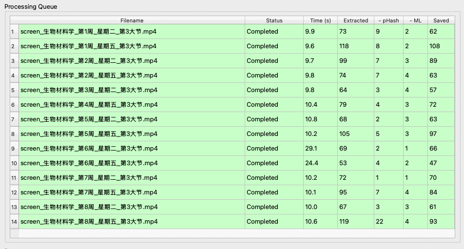
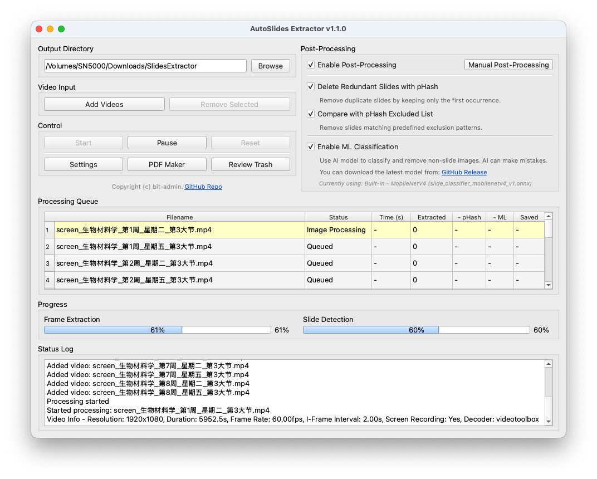
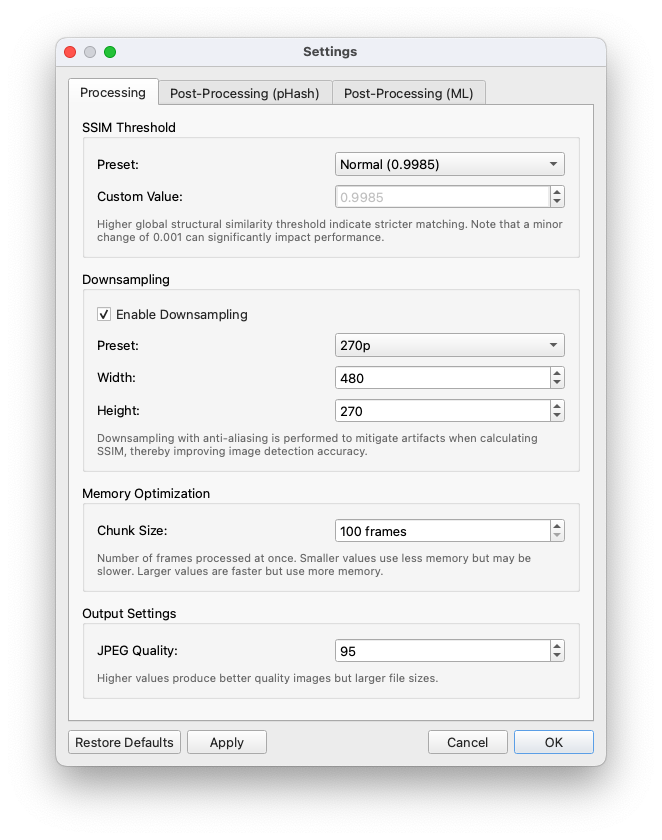
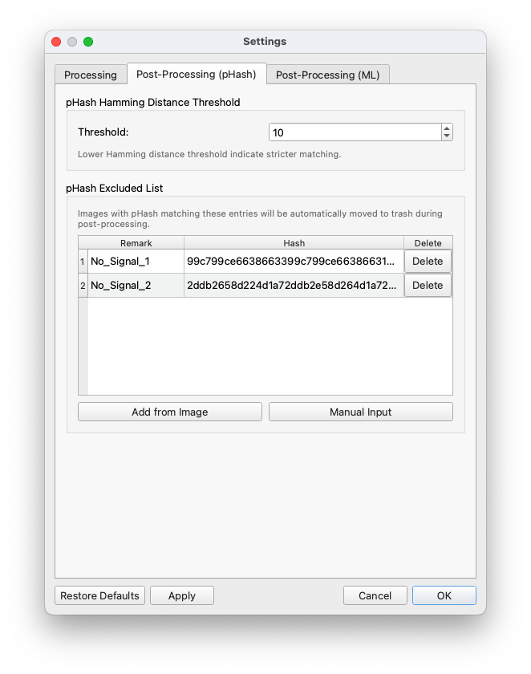
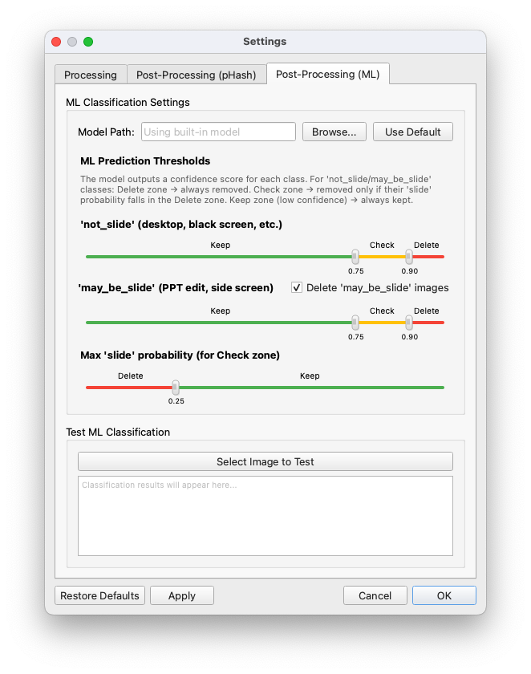
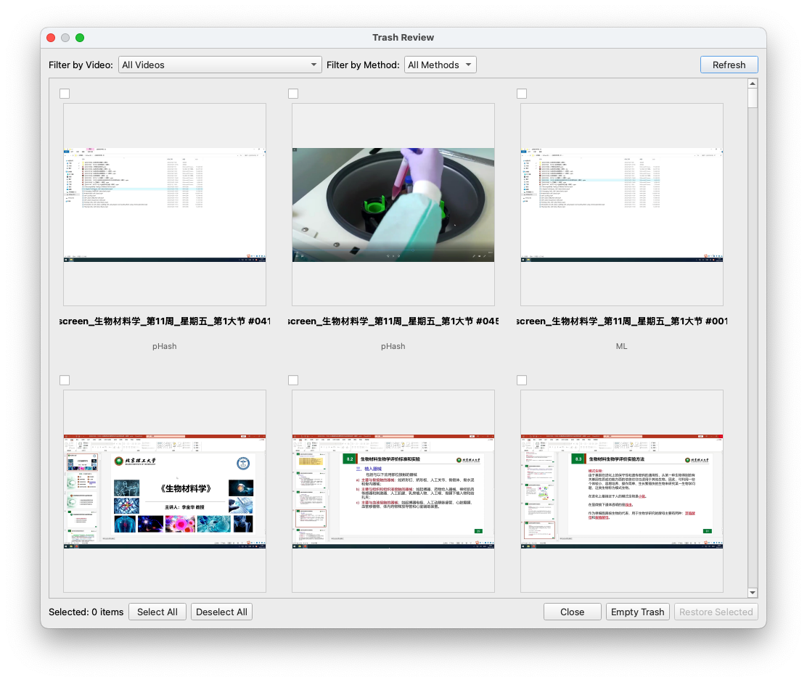
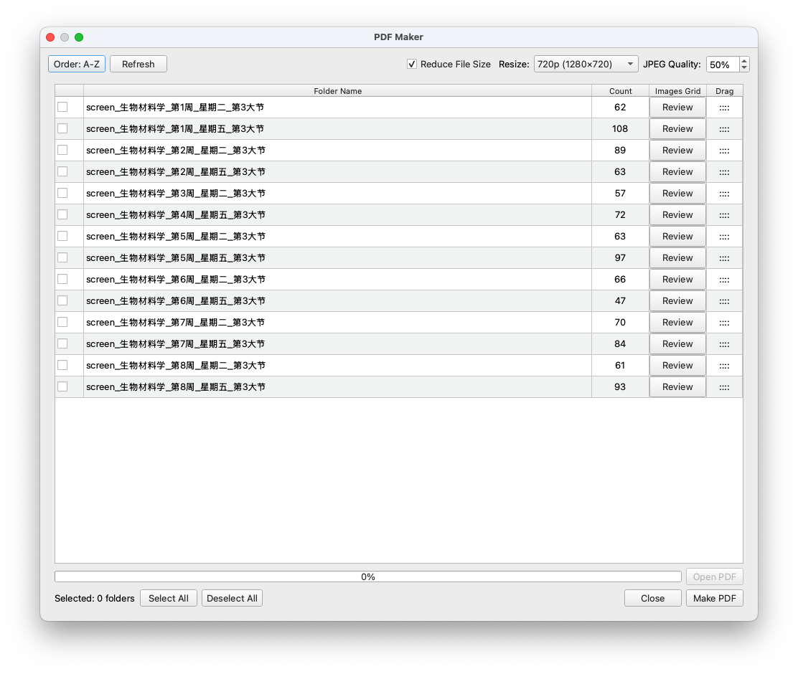

<div align="center">
  
  <h1>AutoSlides Extractor</h1>
  <p><strong>利用先进的计算机视觉技术自动从视频演示中提取幻灯片图像</strong></p>

  <p>
    <a href="https://github.com/bit-admin/AutoSlides-Extractor/releases">
      
    </a>
    
    
  </p>
  <p>
    
    
    
    
  </p>

  <p>
    <a href="#-概览">概览</a> •
    <a href="#-功能特性">功能特性</a> •
    <a href="#-下载与安装">下载</a> •
    <a href="#-快速开始">快速开始</a> •
    <a href="#-工作原理">工作原理</a> •
    <a href="#-构建指南">构建</a>
  </p>
</div>

---

## 概览

**AutoSlides Extractor** 是一款强大的跨平台桌面应用程序，旨在智能识别并从演示视频中提取清晰的幻灯片。它利用先进的计算机视觉算法——特别是 **结构相似性指数 (SSIM)** 和 **感知哈希 (pHash)**——自动检测幻灯片内容的显著变化，并将每一张独特的幻灯片保存为高质量图像。

**v1.1.0 新特性**：新增基于 **MobileNetV4 ONNX 模型** 的 AI 幻灯片分类功能，可自动识别并移除由于非幻灯片内容（如桌面屏幕、黑屏）；新增 **垃圾箱审查系统**；以及用于导出幻灯片的 **PDF 制作工具**。

**相关项目**

| 项目仓库 | 描述 |
|-------------------|---------------|
| [bit-admin/Yanhekt-AutoSlides](https://github.com/bit-admin/Yanhekt-AutoSlides) | 北京理工大学延河课堂第三方客户端；自动提取幻灯片；下载课程录像 |
| [bit-admin/slide-classifier](https://github.com/bit-admin/slide-classifier) | 基于 MobileNetV4 的机器学习模型；在 1.5 万张延河课堂幻灯片图像上训练 |


## ✨ 功能特性

- **可配置灵敏度**：提供预设（严格、普通、宽松）和自定义 SSIM 阈值。
- **批量处理**：支持队列管理，批量处理多个视频。
- **内存优化**：采用分块处理机制，高效处理大型视频文件。
- **极速处理**：处理一节课的视频快至 10 秒。

<p align="center">
  
</p>

| 核心能力 | 先进技术 |
|-------------------|---------------|
| 🎯 **智能幻灯片检测** <br> 使用 SSIM 的两阶段算法进行精确的幻灯片提取 | ⚡ **硬件加速** <br> 支持 CUDA, OpenCL, Metal, DirectX 和 Vulkan GPU 加速 |
| 🧹 **智能后处理** <br> 使用 pHash 和排除列表自动移除冗余幻灯片 | 🤖 **AI 智能分类** <br> MobileNetV4 模型过滤非幻灯片内容 |
| 🗑️ **垃圾箱审查系统** <br> 安全地审查和恢复已移除的幻灯片，保留完整元数据 | 🧩 **高性能** <br> 多线程与 SIMD 优化 (AVX2, NEON) |
| 📄 **PDF 制作工具** <br> 整理提取的幻灯片并导出为压缩的 PDF 文档 | 🎼 **多格式支持** <br> 支持 MP4, AVI, MOV, MKV, WMV, FLV, WebM |

## 📥 下载与安装

### 预构建版本

下载适合您操作系统的最新安装包或便携包：

| 平台 | 下载 | 说明 |
|----------|----------|------|
| **macOS** | **[AutoSlides.Extractor-macOS-arm64.dmg](https://github.com/bit-admin/AutoSlides-Extractor/releases)** | 仅支持 Apple Silicon。需运行下方的隔离修复命令。 |
| **Windows** | **[Setup.exe](https://github.com/bit-admin/AutoSlides-Extractor/releases)** / **[Portable.zip](https://github.com/bit-admin/AutoSlides-Extractor/releases)** | Windows 10 (64-bit) 或更高版本。 |

> [!IMPORTANT]
> **macOS 用户**：安装后，请在终端中运行以下命令以允许应用运行：
> ```bash
> sudo xattr -d com.apple.quarantine /Applications/AutoSlides\ Extractor.app
> ```

### 系统要求
* **OS**: macOS 11+ (Apple Silicon), Windows 10+ (64-bit)
* **CPU**: 推荐四核处理器
* **RAM**: 最低 8 GB (处理大型视频建议 16 GB)
* **GPU**: 推荐用于硬件加速

## 🚀 快速开始

1. **启动** AutoSlides Extractor。
2. **添加视频**：拖拽视频文件或点击 **"Add Videos"**。
3. **配置** (可选)：选择输出目录，如有需要调整 SSIM 灵敏度。
4. **开始**：点击 **Start** 按钮。
5. **审查**：完成后检查输出文件夹。使用 **Trash Review** 恢复误删的幻灯片，或使用 **PDF Maker** 将其合并为文档。

## 🛠️ 使用指南

### 1. 主要流程
*   **输入**：支持主流视频格式。视频加入队列后逐个处理。
*   **监控**：实时状态更新显示：
    *   🟡 **Queued**：等待中。
    *   🔵 **Processing**：FFmpeg 解码 -> SSIM 分析 -> ML 分类。
    *   🟢 **Completed**：完成并显示提取数量。
*   **控制**：轻松暂停、恢复或从队列中移除项目。

### 2. 后处理与 AI
*   **冗余移除**：使用 pHash 查找并删除近似重复的图像。
*   **排除列表**：定义模式（如开场/结束页）以自动忽略。
*   **AI 分类 (v1.1.0)**：
    *   **"slide"**：保留。
    *   **"not_slide"**：移除（例如桌面、黑屏）。
    *   **"may_be_slide"**：可配置动作（保留或删除）。
    *   *提示：使用设置中的可视化范围滑块调整置信度阈值。*

### 3. PDF 导出
*   导航至 **PDF Maker**。
*   选择包含已提取幻灯片的根文件夹。
*   选择排序方式（名称/日期）和输出质量（调整大小/压缩）。
*   生成演示文稿的单一 PDF 文档。

<table align="center" width="100%">
  <tr>
    <td align="center" width="50%">
      
    </td>
    <td align="center" width="50%">
      
    </td>
  </tr>
  <tr>
    <td align="center" width="50%">
      
    </td>
    <td align="center" width="50%">
      
    </td>
  </tr>
  <tr>
    <td align="center" width="50%">
      
    </td>
    <td align="center" width="50%">
      
    </td>
  </tr>
</table>

## 🎯 工作原理

1.  **第一阶段：变化检测 (SSIM)**
    *   对帧（I帧）进行采样并计算结构相似性。
    *   相似度显著下降标志着潜在的新幻灯片。
2.  **第二阶段：稳定性验证**
    *   检查后续帧以确保“新幻灯片”是稳定的，而不仅仅是过渡效果。
3.  **第三阶段：去重 (pHash)**
    *   计算提取图像的感知哈希值。
    *   即使存在微小的像素噪点，也能移除重复项。
4.  **第四阶段：AI 过滤 (MobileNetV4)**
    *   对图像内容进行分类，移除桌面壁纸或空白屏幕等非幻灯片元素。

## ⚙️ 技术细节

**架构**:
`视频输入` → `硬件解码器` → `SSIM 分析` → `图像输出` → `pHash 去重` → `ML 分类` → `PDF 导出`

**性能**:
*   **SIMD**: SSE4.2, AVX2, AVX512, NEON。
*   **GPU 加速**: CUDA, DirectML, Metal, OpenCL。
*   **推理**: Core ML (macOS), CUDA/DirectML (Windows)。

## 🔧 构建指南

**先决条件**:
*   **C++17 编译器**, **CMake 3.16+**
*   **Qt 6** (Core, Widgets, Gui)
*   **OpenCV 4.x**, **FFmpeg**

**构建步骤**:
```bash
git clone https://github.com/bit-admin/AutoSlides-Extractor.git
cd AutoSlides-Extractor
mkdir build && cd build

# 配置
cmake ..
# 或指定特定优化
# cmake -DENABLE_CUDA=ON ..

# 构建
cmake --build . --config Release
```

## ❓ 常见问题 (Troubleshooting)

| 问题 | 解决方案 |
|-------|----------|
| **macOS 提示 "App is damaged"** | 在终端运行 `sudo xattr -d com.apple.quarantine /Applications/AutoSlides\ Extractor.app`。 |
| **未使用 GPU** | 确保已安装最新驱动。Windows 用户请检查 NVIDIA 显卡是否已安装 CUDA。 |
| **漏掉幻灯片** | 尝试 **"Strict"** SSIM 预设或降低自定义阈值（例如降至 0.995）。 |
| **重复过多** | 启用 **Post-Processing** 并降低 **Hamming Threshold**（例如降至 8）。 |

## 📄 许可证

本项目采用 [MIT License](LICENSE) 许可证。

---

<p align="center">
  <em>Made with ❤️ using Qt6, OpenCV, and FFmpeg</em>
</p>
